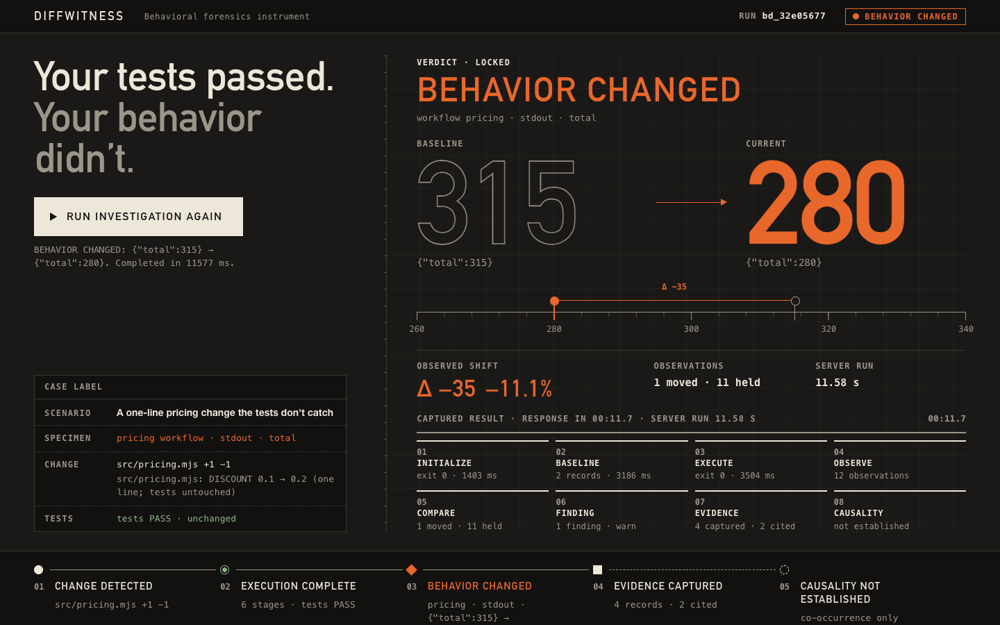

# DiffWitness

**Detect behavioral changes that tests and Git diffs can miss.** See what changed, with execution evidence.

- **Live demo:** https://diffwitness.onrender.com
- **Source:** https://github.com/CodewithJha/diffwitness
- **Demo video:** TODO — add the video URL



## The problem

A one-line change to a constant ships. The unit tests pass, and the diff looks harmless. But the number a customer sees has changed:

```diff
-export const DISCOUNT = 0.1;
+export const DISCOUNT = 0.2;
```

The tests check the shape of the result, not the value. The Git diff shows *what text* changed, not *what the program now does*. Nobody sees that the quote for the same order went from 315 to 280 until someone complains.

DiffWitness runs the commands whose output you care about, stores the results as **evidence**, and after a change tells you exactly which observable behavior changed, with before/after values and evidence IDs. It never guesses and never claims a file *caused* a change.

## What it looks like

This is real output from `diffwitness check` on the example above (`npm run demo` reproduces it):

```text
BEHAVIOR CHANGED (status: findings)
Observations: 11 unchanged · 1 changed · 0 appeared · 0 disappeared

Workflows (2):
  pricing  CHANGED    exit 0 (pass)  1 finding(s)
  tests    unchanged  exit 0 (pass)

Finding 1/1  [warn] pricing · stdout — Normalized stdout changed (stdout_changed)
  Before:   {"total":315}
  After:    {"total":280}
  Evidence: baseline ev_c5656baf-… → current ev_36196e16-…
  Changed alongside (Git): src/pricing.mjs (modified)
  Causality: not established
```

The `tests` workflow is the project's own test suite. It is **unchanged and passing**, and that is the point.

## Quickstart

Requirements: Node.js 20+, Git.

```bash
git clone https://github.com/CodewithJha/diffwitness.git && cd diffwitness
npm ci
npm run build            # installs and builds packages/diffwitness
npm run demo             # the pricing example above, end to end, in a temp repo
```

Use it on your own repository:

```bash
cd packages/diffwitness && npm pack          # the package is not published to npm
cd /path/to/your/repo
npm install --no-save /path/to/diffwitness-0.1.0.tgz

npx diffwitness init        # writes a commented .diffwitness/config.yaml
# edit the workflow command: something whose output you care about
git add .diffwitness && git commit -m "diffwitness config"
npx diffwitness baseline    # run workflows, store evidence
# ...change code...
npx diffwitness check       # what behavior changed, with evidence
npx diffwitness explain     # offline explanation of the evidence (MockAI)
npx diffwitness ci --fail-on warn   # CI gate: exit 1 when behavior changed
```

Full CLI reference, exit codes, config, and security notes: [`packages/diffwitness/README.md`](packages/diffwitness/README.md).

## Why not just…

| | What it tells you | What it misses |
|---|---|---|
| **Git diff** | Which lines of text changed | What the program now *does* |
| **Unit tests** | Whether the assertions you wrote still hold | Everything you didn't assert, like the exact total above |
| **Snapshot tests** | That a stored snapshot no longer matches | Needs a test per output; no link to evidence or to the change |
| **DiffWitness** | Which observable outputs of real commands changed, with before/after values, evidence IDs, and the files that changed alongside | Anything your workflows don't exercise; *why* it changed (it reports co-occurrence, not cause) |

DiffWitness sits next to tests. It doesn't replace them. You point it at commands you already have (a CLI, a report script, `npm test`), and it keeps the evidence.

## How it works

1. **Workflows.** `.diffwitness/config.yaml` lists argv commands (no shell). Each run records the exit code and normalized stdout/stderr, plus any listed artifact files.
2. **Evidence.** Each observation is stored with a SHA-256 digest and a short redacted preview under an evidence ID (`ev_…`). `baseline` pins a set of evidence as the reference.
3. **Deterministic diff.** `check` reruns the workflows and compares digests. The result is `clean`, `findings`, or `analysis_error`, and an analysis error is never shown as clean.
4. **Change surface.** Files that changed per Git since the baseline commit are listed next to findings as **co-occurrence only**. Every finding is marked `Causality: not established`.
5. **Explanation (optional).** `explain` builds a bounded, redacted evidence packet. The default MockAI explainer is deterministic and offline. An optional live model (Featherless) sees only that packet.

## AI trust model

- The deterministic diff engine decides status, findings, and exit codes. The AI layer cannot change any of them.
- The default explainer is **MockAI**, a deterministic offline template. No network, no key. The hosted demo uses only MockAI.
- A live model is opt-in (`--provider featherless` plus `FEATHERLESS_API_KEY`). It receives only the redacted evidence packet: no file contents, no keys.
- Every model-generated string passes a wording gate. Causal claims ("caused", "because", "root cause", …) and "safe to merge"-style claims on an analysis error are rejected, and a rejected explanation is never shown. The gate filters wording; it doesn't prove honesty.
- `ci` runs with AI off unless you pass `--explain`, and an AI failure never turns a result clean.

## Use in CI (GitHub Actions)

CI compares against the **local active baseline**, so capture it on the base commit in the same job. There is no merge-base or PR inference.

```yaml
# .github/workflows/diffwitness.yml — sketch; the equivalent local sequence is covered by the test suite
name: diffwitness
on: pull_request
jobs:
  behavior:
    runs-on: ubuntu-latest
    steps:
      - uses: actions/checkout@v4
        with: { fetch-depth: 0 }
      - uses: actions/setup-node@v4
        with: { node-version: 20 }
      - name: Install DiffWitness outside the checkout (packed tarball committed under tools/)
        run: |
          npm install --prefix "$RUNNER_TEMP/diffwitness" ./tools/diffwitness-0.1.0.tgz
          echo "$RUNNER_TEMP/diffwitness/node_modules/.bin" >> "$GITHUB_PATH"
      - name: Baseline on the PR base
        run: |
          git checkout --detach ${{ github.event.pull_request.base.sha }}
          diffwitness baseline
      - name: Check the PR head
        run: |
          git checkout --detach ${{ github.event.pull_request.head.sha }}
          diffwitness ci --fail-on warn
```

`.diffwitness/config.yaml` must exist on both commits, and `ci` requires a source-clean tree, so install tools outside the checkout. `ci` prints versioned JSON on stdout. The exit codes are: 0 acceptable, 1 findings at or above `--fail-on`, 2 user or config error, 3 analysis error, 4 explain error. Precedence is 3 > 1 > 4 > 0.

## Hosted demo

`npm start` (after `npm run build`) serves a small page that runs the **real CLI** on a built-in example in a fresh temporary Git repository per request, using MockAI only. It never executes visitor input and has no accounts, tracking, or database. Endpoints: `GET /health` (liveness), `GET /ready` (503 until Git is available), `GET /api/scenarios`, `POST /api/demo`. Deployment: [`docs/DEPLOYMENT.md`](docs/DEPLOYMENT.md).

## Limitations

- Evidence is only as good as your workflows. Behavior they don't exercise is invisible.
- Output must be deterministic. Timestamps, random IDs, and durations must be normalized away (`normalize.ignoreLinePatterns`) or they show up as changes.
- Comparison is against a stored local baseline: no PR merge-base inference and no history browsing.
- DiffWitness reports co-occurrence between findings and changed files, never causality. There is no symbol-level attribution.
- Workflows execute commands from your repository's config. This is not a sandbox for untrusted repositories.
- On Windows only the direct child process is killed on timeout (no process groups).

## Related work and naming

- **Snapshot / approval testing** (Jest snapshots, ApprovalTests): compare stored output inside a test framework. DiffWitness works on arbitrary commands outside any test framework, keeps evidence IDs, and links findings to the Git change surface.
- **CLI transcript tests** (cram, trycmd): assert expected command output written by hand. DiffWitness records the baseline for you and reports what moved.
- **[RealDiff](https://github.com/issacnitin/RealDiff)**: runtime behavior diffs for pull requests with multi-language instrumentation. It is heavier and instrumentation-based, while DiffWitness is a small local CLI over command-level evidence with a bounded explainer.
- **Selfsame**: another project in the behavior-comparison space.
- **Former working name:** DiffWitness was developed under the working name "SemaDiff" and renamed before its first public release. The old name is shared by unrelated projects: arXiv 2607.13111 (an academic paper) and BleedingDev/semadiff (a separate TypeScript CLI).

## Documentation

| | |
|---|---|
| CLI reference, exit codes, security | [`packages/diffwitness/README.md`](packages/diffwitness/README.md) |
| Product requirements | [`docs/DIFFWITNESS-PRD.md`](docs/DIFFWITNESS-PRD.md) |
| Technical specification | [`docs/TECHNICAL-SPECIFICATION.md`](docs/TECHNICAL-SPECIFICATION.md) |
| Architecture | [`docs/ARCHITECTURE.md`](docs/ARCHITECTURE.md) |
| CLI specification | [`docs/CLI-SPECIFICATION.md`](docs/CLI-SPECIFICATION.md) |
| AI architecture | [`docs/AI-ARCHITECTURE.md`](docs/AI-ARCHITECTURE.md) |
| Threat model | [`docs/THREAT-MODEL.md`](docs/THREAT-MODEL.md) |
| Deployment | [`docs/DEPLOYMENT.md`](docs/DEPLOYMENT.md) |

Built for [HACK47: OFFGRID](https://hack47-offgrid.devpost.com/). Pre-product planning history is kept under [`archive/`](archive/README.md).

## License

MIT. See [`LICENSE`](LICENSE).
