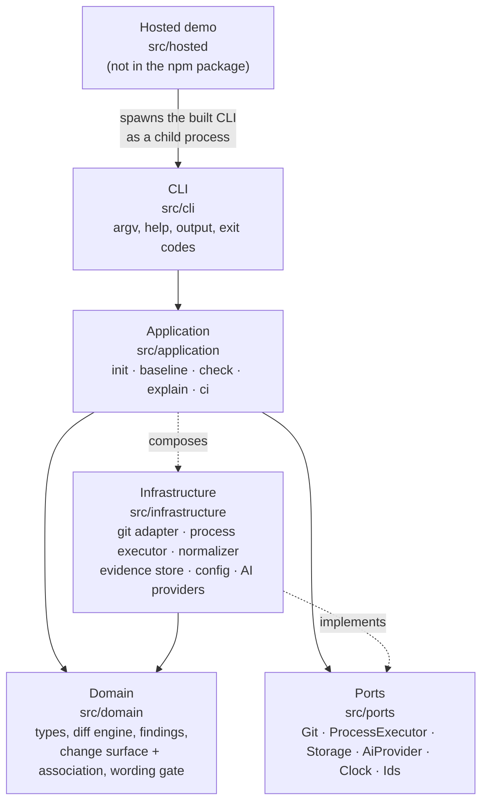
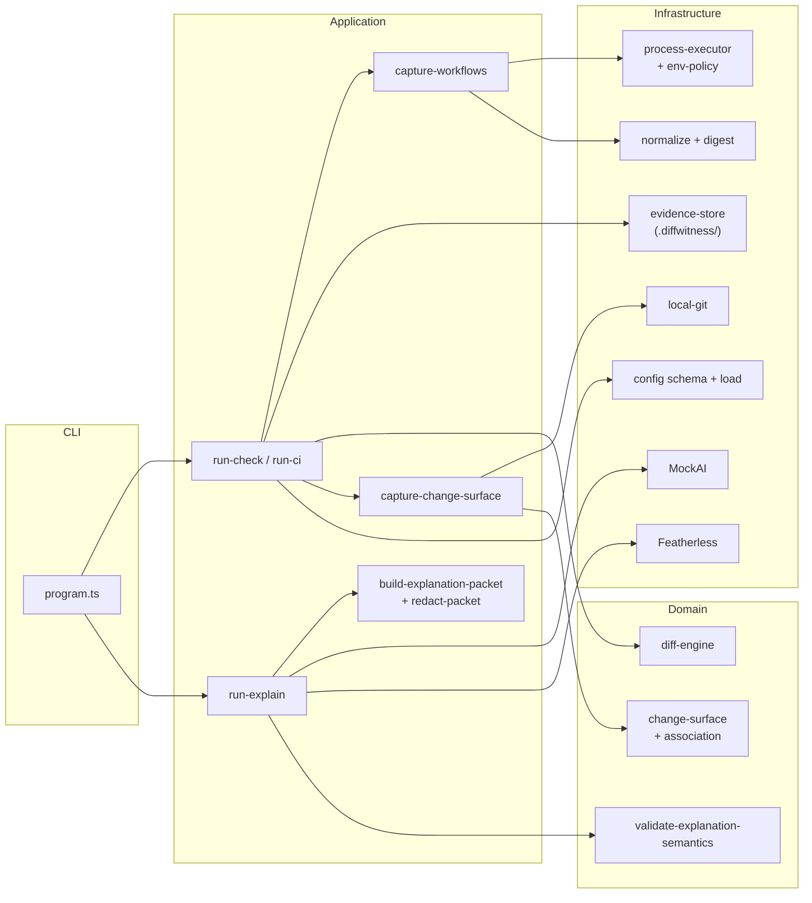

# Architecture

DiffWitness is a single TypeScript CLI (a modular monolith) in [`packages/diffwitness/`](../../packages/diffwitness/). There are no services, queues or agents. A small hosted demo server ships in the same package but is not part of the CLI or the npm tarball.

- [Product model](#product-model): local mode, hosted demo, optional AI
- [Layers](#layers) and the [component map](#component-map)
- [Data flow](#data-flow) for `baseline`, `check` and `explain`
- [Hosted demo boundary](#hosted-demo-boundary)
- Deeper: [AI architecture](ai.md), [technical specification](technical-specification.md) (design document), [security model](../security/README.md)

## Product model

DiffWitness is used in three ways. All three run the same engine.

### 1. Local mode (the product)

You install the CLI and run it in your own Git repository. It executes the workflows from your `.diffwitness/config.yaml`, stores evidence in `.diffwitness/`, and compares later runs with a baseline. Everything happens on your machine or CI runner. Nothing is uploaded, and no account or network access is needed.

### 2. Hosted demo (a controlled demonstration)

The hosted demo is a controlled demonstration, not a simulation: it runs the same DiffWitness CLI and engine you install locally, on a built-in scenario, in a fresh temporary Git repository, so anyone can reproduce the result safely.

Each click copies the built-in pricing project into a new temporary repository, runs the real `diffwitness init`, `baseline`, `check` and `explain --provider mock`, relays their output, and deletes the repository. It never runs visitor input, never clones repositories and uses MockAI only. See [Hosted demo boundary](#hosted-demo-boundary).

### 3. Optional AI

AI is an optional last step that can only explain an existing result:

```text
deterministic finding  →  evidence packet  →  optional explanation
(diff engine, no AI)      (bounded, redacted)   (MockAI by default; Featherless opt-in)
```

What AI does **not** do:

- decide findings, severities, status (`clean` / `findings` / `analysis_error`) or exit codes
- decide what runs, or execute anything (providers have no execution interface)
- see the repository, the filesystem, file contents or Git
- decide which files are in the change surface, or establish causality
- run in `ci` unless `--explain` is passed

Implemented providers: `mock` (default; a deterministic offline template, no network, no key), `none` (no explanation) and `featherless` (a live OpenAI-compatible API, opt-in, key from an environment variable). Details: [AI architecture](ai.md).

## Layers



| Layer | May depend on | Must not |
|---|---|---|
| Domain | nothing outside the domain | touch the filesystem, processes, network or CLI |
| Application | domain, ports, and infrastructure modules it composes (config loading, normalizer, evidence store, provider selection) | perform side effects itself (processes, Git, storage and AI are reached through `ProcessExecutor`, `GitPort`, `StoragePort` and `AiProvider`); know HTTP or provider wire formats |
| Infrastructure | domain types and ports | encode product policy beyond implementing a port |
| CLI | application | duplicate domain rules |
| Hosted | the built CLI, as a subprocess | contain DiffWitness analysis logic |

## Component map



| Component | Responsibility | Code |
|---|---|---|
| Config loader | Parse and strictly validate `.diffwitness/config.yaml`; fail closed on unknown versions | `infrastructure/config/` |
| Git adapter | Repository root, commit identity, dirty state, working-tree diff for the change surface; argv-only `git` | `infrastructure/git/` |
| Process executor | Spawn workflows argv-only with timeouts, output caps, process groups and interrupt handling | `infrastructure/execution/` |
| Normalizer | Deterministic normalization (ANSI, line endings, ignored lines, sorting, env redaction, byte cap) and SHA-256 digests | `infrastructure/evidence/normalize.ts`, `digest.ts` |
| Evidence store | Persist evidence, content-addressed blobs, baselines and comparisons under `.diffwitness/`; versioned records | `infrastructure/evidence/evidence-store.ts` |
| Diff engine | Compare baseline and current observations by digest; produce the BehavioralDiff (`clean` / `findings` / `analysis_error`) and findings with severities | `domain/diff-engine.ts` |
| Change surface | Files changed since the baseline commit, limits and truncation; association of findings as co-occurrence only | `domain/change-surface*.ts`, `application/capture-change-surface.ts` |
| Findings output | Human and JSON formatters | `application/format-*.ts`, `run-*.ts` |
| AI boundary | Build and redact the evidence packet, call the provider, validate schema, citations and wording | `application/build-explanation-packet.ts`, `redact-packet.ts`, `run-explain.ts`, `domain/validate-explanation-semantics.ts`, `infrastructure/ai/` |
| Hosted boundary | HTTP server that sequences the real CLI on the built-in scenario | `src/hosted/` |

## Data flow

**`baseline`:** load config → resolve Git identity → run each workflow (executor) → normalize and hash stdout, stderr and artifacts → store evidence and blobs → write the baseline record and point `baselines/active.json` at it. No AI.

**`check`:**

```text
load config + active baseline
LocalGit ──► captureChangeSurface (before execution)
executor ──► evidence ──► diff engine ──► BehavioralDiff (findings, status)
LocalGit ──► captureChangeSurface (after execution)
confirmExecutedState(before, after)            # differ → association unavailable
associateChangeSurface(diff, surface)          # domain; co-occurrence only
store evidence + BehavioralDiff (runs/), verify the baseline pointer is unchanged
```

The change surface never alters findings, severities, status, the BehavioralDiff id or exit codes. No model participates in change-surface membership or association.

**`explain`:** load the stored BehavioralDiff (refusing incomplete or stale results) → build the evidence packet (EvidencePacket.v2) within the `ai.*` budgets → redact → provider `explain(packet)` → validate schema, citations and wording → print. Validation failure is an explain error (exit `4`); the stored result is untouched.

**`ci`:** `check` with CI defaults (source-clean tree required, `--fail-on error`, JSON on stdout), plus `explain` only with `--explain`. Exit precedence `3 > 1 > 4 > 0`.

## Hosted demo boundary

```text
browser ──POST /api/demo {"scenario":"pricing-discount-change"}──▶ http-app
          (JSON only, ≤ 1 KiB, strict schema, registry lookup, capacity check)
                                   │
                                   ▼
                     run-demo: per-request mkdtemp workspace
                       copy the built-in pricing project → git init/commit
                         (argv-only, no hooks, no host Git config, allowlisted env)
                       child: node dist/cli/main.js --repo <ws> init | baseline | check | explain --provider mock [--json]
                       built-in change (src/pricing.mjs DISCOUNT 0.1 → 0.2) → git diff
                       parse `explain --json` → findings and explanation copied verbatim
                       remove the workspace (always)
                                   │
browser ◀── stages[] (command, exit code, output) + findings + explanation + summary
```

- The server contains no analysis logic. Diffing, evidence, the change surface, the evidence packet, MockAI and findings all run inside the real CLI process. The server only sequences built-in commands and relays their output.
- The `summary` in the response is a presentation view derived from the CLI's JSON, never recomputed analysis.
- Limits and deployment: [Hosted demo reference](../reference/hosted-demo.md) and [Deployment](../DEPLOYMENT.md). Security controls: [Security model](../security/README.md#hosted-demo-boundary).

## What is deliberately not here

- No microservices, queues, databases or multi-tenant control plane.
- No agent loops, tool calling, embeddings or model routing.
- No GitHub or GitLab API integration and no pull-request merge-base inference.
- No symbol-level attribution or causal inference.

Future evidence sources (structured JSON observations, test-report parsers) are meant to plug in behind evidence capture without changing the domain. See the [roadmap](../ROADMAP.md).
